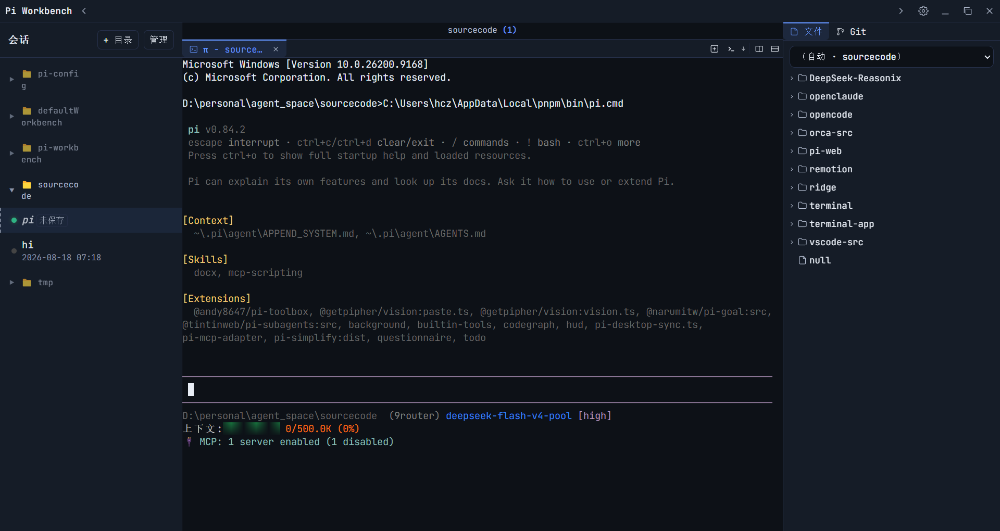

# pi-workbench

> 📖 English docs: [README.md](./README.md)

面向 AI 编程工作流的桌面 IDE：把 `pi` CLI 的**真实终端界面（TUI）**封装进多个相互隔离的终端，配合现代分屏工作区进行管理。



---

## 功能特性

### Pi 会话

- 运行多个隔离的 `pi` CLI 会话，每个拥有独立的终端面板。
- 会话按项目目录分组展示在侧边栏，运行状态一目了然。
- 切换会话不杀进程——任务在后台持续运行，切回时瞬时恢复。
- 新建、终止、单条删除或批量删除会话。
- 未保存会话（首次输入前）在分组顶部显示。

### 集成 Shell 终端

- 在任意工作区启动通用 Shell 终端（PowerShell、CMD、Git Bash、bash、zsh），与 pi 会话并行。
- VS Code 风格的 Shell Integration，支持命令追踪、输出标记和自动 cwd 检测。
- 可配置默认终端 profile、光标样式、字体和滚动行为。

### 分屏工作区

- 每个项目目录拥有独立的 workspace，支持多 Tab 和分屏布局。
- 可将工作区水平或垂直分割成多个窗格，每个窗格拥有独立的 Tab 条。
- 拖拽分隔线调整窗格大小。
- 同一窗格内可混合不同类型 Tab（pi 会话、shell 终端、文件预览、diff、会话历史）。
- Tab 历史：关闭当前 Tab 时自动回到上一个访问的 Tab。

### Tab 管理

- 同窗格内拖拽重排 Tab 顺序。
- 跨窗格拖拽 Tab——在同工作区下移动到另一个窗格。
- Keep-alive：切换 Tab 不销毁进程，保留终端内容和滚动位置，切回瞬时恢复。
- Tab 类型：会话、集成终端、文件预览、diff、会话内容查看。

### 文件浏览器

- VS Code 风格的文件树，支持虚拟滚动，大型项目也能流畅浏览。
- Git 状态徽章（M/A/D）直接显示在文件和文件夹上，变更一目了然。
- 内联重命名、新建文件/目录、删除。
- 通过剪贴板剪切、复制、粘贴文件。
- 从文件树拖拽文件到终端可插入绝对路径。
- 右键菜单提供常用文件操作和「用系统默认程序打开」。
- 外部文件变更自动刷新。

### 代码编辑器与预览

- **Monaco 代码编辑器**，支持语法高亮、语言检测和脏状态追踪。
- **Markdown 三合一**——渲染预览（GFM 表格、数学公式、Mermaid 图表、自动目录）、富文本所见即所得（TipTap）、源码编辑三种模式自由切换。
- **图片预览**，支持缩放、平移和缩放工具栏。
- **Diff 查看器**——单栏 unified diff，按文件折叠，支持工作区变更和提交 diff。
- 外部文件变更检测，自动重新加载。

### Git 集成

- **完整 Git 工作台**：仿 VS Code Source Control 视图，三分组展示——Staged Changes / Changes / Untracked Changes。
- **暂存/取消暂存**：文件级或批量操作，单击「+」暂存、「−」取消暂存。
- **提交**：内联输入框，支持 Stage All + Commit、Amend、Sign-off，空消息校验。
- **撤销修改**：Revert（已跟踪文件回滚到 HEAD）和 Clean（删除未跟踪文件）。
- **分支管理**：点击分支名打开分支选择器，可创建新分支或切换已有分支。
- **远程同步**：Sync / Pull / Push / Fetch 一键按钮组，支持 force push 选项。
- **当前分支名**及 ahead/behind 指示器，显示变更行数。
- **最近的提交记录**——点击任意提交可打开其 diff，支持按消息/作者搜索过滤。
- **工作区 diff** 实时自动刷新，操作队列防止并发冲突。
- **操作进度动画**：写操作进行中显示旋转指示器。
- **文件树中**每个文件和文件夹显示 Git 状态徽章（M/A/D/R/U/冲突）。
- Git Tab 在有未提交变更时显示脏状态指示器（黄点）。

### 会话内容查看器

- 在工作区中以 Tab 形式查看完整的 pi 会话历史。
- 消息按轮次分组（用户消息 + 助理回复链）。
- 思考过程和工具调用折叠为「过程」区域，仅显示最终回复。
- 可直接从查看器启动或删除会话。

### Pi 配置管理

- **配置文件编辑器**——以表单或原始 JSON 模式编辑 `settings.json`（全局或项目范围）。
- **模型配置**——管理提供方和模型，支持完整兼容性标志、费用配置和思考级别映射。
- **MCP 管理器**——跨 4 个配置层（用户全局、Pi 全局、项目共享、项目 Pi）管理 MCP 服务器。支持 stdio、HTTP 和 Unix Socket 传输。可从 cursor、claude-code、VS Code 等导入配置。
- **Skills 管理**——列出、启用、禁用、删除 skill。支持按来源分组批量操作。
- **扩展管理**——列出、启用、禁用、删除已安装扩展。

### 设置面板

- **常规**——主题（深色/浅色）、关闭按钮行为、字体大小、版本更新检查。
- **会话管理**——浏览、删除或批量删除会话文件。
- **终端**——默认 profile、光标设置、字体设置、滚动行为、滚动条宽度。

### 窗口与 UI

- 无边框窗口，自建主题感知标题栏。
- 8 向边缘缩放热区。
- 系统托盘，右键菜单「显示 / 退出」。
- 启动时显示启动画面。
- 窗口状态持久化（位置、大小、最大化）。
- 单实例锁。`pnpm dev` 默认带 `PI_DESKTOP_DEV=1`，以独立实例运行（与安装版独立配置、可同时运行）。

### 版本更新

- 通过 GitHub Releases 检查更新（无需 API Key）。
- 发现新版本时提供 release 页面链接，由用户在浏览器中下载安装包。

### 安全与沙箱

- 渲染进程沙箱化（`nodeIntegration: false`、`contextIsolation: true`、`sandbox: true`）。
- 所有进程和 PTY 管理仅在主进程运行。
- 安全清理：关闭应用时终止所有运行中的进程。
- 文件系统桥带根目录边界检查。

---

## 快速开始

```bash
pnpm install
pnpm dev          # 开发模式（Electron + Vite HMR）
pnpm build        # 生产构建
pnpm start        # 预览构建产物
pnpm dist         # 构建可分发包（平台默认）
pnpm dist:win     # 构建 Windows NSIS 安装程序
```

## 测试

```bash
pnpm test          # 单元测试
pnpm test:watch    # 监听模式
pnpm test:e2e      # 端到端测试（Playwright 启动真实 Electron）
```

## 许可证

详见仓库设置。